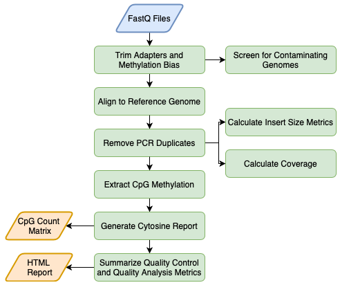

# CpG_Me
<!-- badges: start -->

<!-- badges: end -->

A Whole Genome Bisulfite Sequencing (WGBS) Alignment Pipeline

**Website:** [ben-laufer.github.io/CpG_Me/](https://ben-laufer.github.io/CpG_Me)

## Overview

CpG_Me is an optimized and comprehensive WGBS alignment pipeline for a SLURM job scheduler on a high-performance computing cluster. CpG_Me takes you from raw fastq files to CpG methylation count matrices (Bismark cytosine reports), where it processes data to remove biases and provides ample QC/QA. Scripts are available for both paired end (PE) and single end (SE) sequencing approaches. The extracted CpG methylation count matrices can be then be used for the identification of differentially methylated regions (DMRs) through the accompanying [DMRichR](https://github.com/ben-laufer/DMRichR) workflow.

## Overview

A single command line call runs the main pipeline for all samples and a final command line call generates html QC/QA reports for all samples.

## Website Table of Contents

0. [Overview](https://ben-laufer.github.io/CpG_Me#overview)
1. [Quick Start](https://ben-laufer.github.io/CpG_Me#quick-start)
2. [Installation](https://ben-laufer.github.io/CpG_Me#installation)
3. [Merging Lanes](https://ben-laufer.github.io/CpG_Me#merging-lanes)
4. [Correcting for Methylation Bias (m-bias)](https://ben-laufer.github.io/CpG_Me#correcting-for-methylation-bias-m-bias)
5. [Run the Pipeline](https://ben-laufer.github.io/CpG_Me#run-the-pipeline)
6. [QC Report](https://ben-laufer.github.io/CpG_Me#qc-report)
7. [DMR Calling](https://ben-laufer.github.io/CpG_Me#dmr-calling)
8. [Citation](https://ben-laufer.github.io/CpG_Me#citation)
9. [Publications](https://ben-laufer.github.io/CpG_Me#publications)
10. [Acknowledgements](https://ben-laufer.github.io/CpG_Me#acknowledgements)
